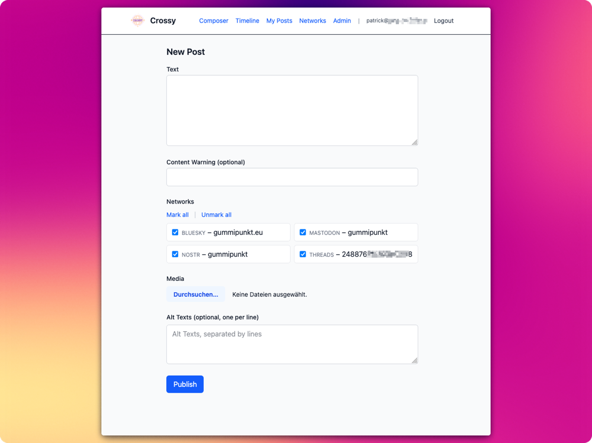
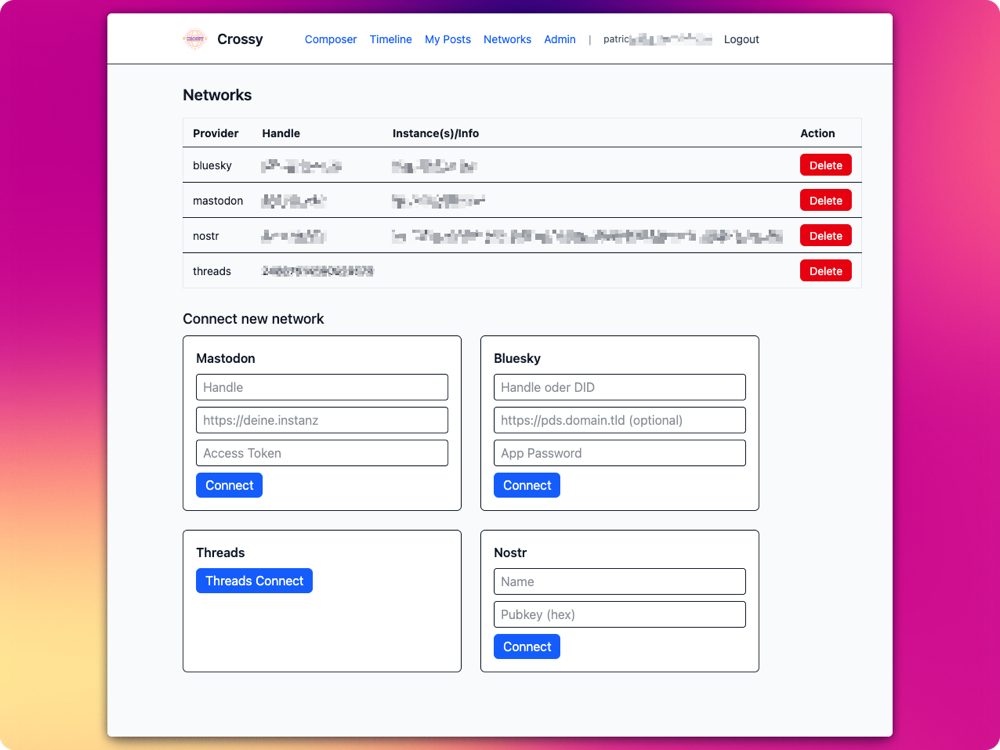
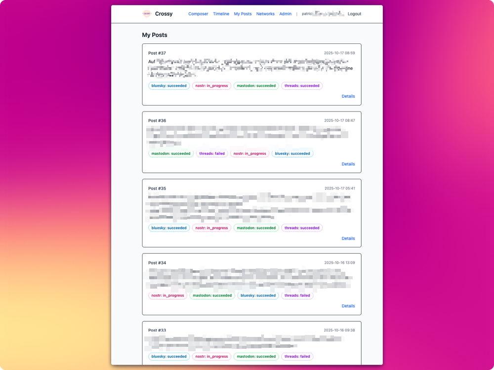
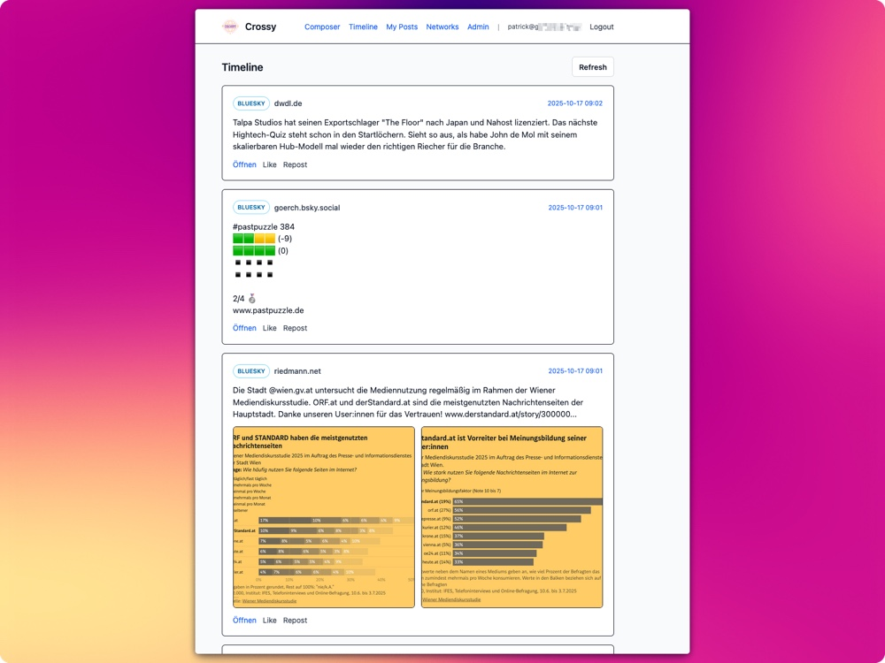

# Crossy


A small Rails app that helps you post to multiple social networks at once. It started as a single-user tool and is being built so it can grow into a multi-user SaaS later.

**Networks:** Mastodon, Bluesky, Threads, and **Nostr** (compose/sign/publish via **NIP-07** in the browser; relays are configured in code).

## What it does

- Composer with file uploads and alt text
- Pick the networks you want (including “Select all”)
- Background deliveries with per-provider status
- Unified timeline across connected accounts (auto-refresh, like/repost)
- Encrypted token storage (Lockbox + Blind Index)
- Sign up / sign in (Devise)
- Multi-user mode with an admin area (promote admins, manage users)

## Screenshots









## Tech

- Ruby 3.3, Rails 8
- PostgreSQL (app plus separate DBs for Solid Cache, Solid Queue, Solid Cable in the default Docker setup)
- Redis (included in Docker Compose; optional depending on how you wire features)
- Solid Queue for background jobs (database-backed in the default configuration)
- Tailwind CSS, esbuild, Hotwire (Turbo, Stimulus)
- Faraday for HTTP calls
- Security: Devise, Rack::Attack, Secure Headers, Lockbox, Blind Index, SSRF checks on user-supplied instance URLs

## Run with Docker Compose

The repo ships one compose file: [`docker-compose.yml`](docker-compose.yml). It runs Rails in **production** mode with a source bind mount (good for local iteration), bundled **web** and **worker** services, Postgres, and Redis.

**Requirements:** Docker and Docker Compose.

### 1. Clone and configure

```bash
git clone https://github.com/gummipunkt/crossy.git
cd crossy
cp env/.env.production.example env/.env.production
# Edit env/.env.production: SECRET_KEY_BASE, LOCKBOX_MASTER_KEY, BLIND_INDEX_MASTER_KEY,
# PUBLIC_BASE_URL, SMTP, Threads keys, etc.
```

Use a strong `POSTGRES_PASSWORD` (and matching credentials in `DATABASE_URL` if you override it). See comments at the top of `docker-compose.yml` for Redis password / deploy hygiene.

### 2. Start the stack

```bash
docker compose up -d --build
```

The **web** container runs `db:prepare`, builds JS/CSS, precompiles assets, then starts Puma on port **3000** inside the container.

### 3. Open the app

- **From your machine:** [http://localhost:3022](http://localhost:3022) (host port **3022** is mapped to container port 3000)
- Health check: `GET /up`
- Root / composer: `/`
- Timeline: `/timeline`
- Your posts: `/my`
- Provider accounts: `/provider_accounts`

### First-time / manual asset build (if needed)

If assets are missing:

```bash
docker compose exec -w /app/server web bash -lc "bin/rails javascript:build && bin/rails css:build && bin/rails assets:precompile"
```

### Database migrations (if you run commands yourself)

```bash
docker compose exec -w /app/server web bash -lc "bin/rails db:migrate"
```

## Configuration

Environment variables are loaded from **`env/.env.production`** (see [`env/.env.production.example`](env/.env.production.example)). Additional examples live in [`.env.production.example`](.env.production.example) and [`.env.development.example`](.env.development.example).

**Important**

- **`PUBLIC_BASE_URL`** — OAuth redirects, mailer links, host authorization (with `localhost` / `127.0.0.1` allowed for internal checks where configured).
- **Threads** — Whitelist redirect URI: `https://<your-domain>/auth/threads/callback`. Use **threads.net** OAuth/Graph URLs, not **threads.com**.
- **Lockbox / Blind Index** — `LOCKBOX_MASTER_KEY`, `BLIND_INDEX_MASTER_KEY` (64 hex chars for blind index; keep quoted in env files).

**SMTP (password reset):** `MAILER_SENDER`, `SMTP_ADDRESS`, `SMTP_PORT`, `SMTP_DOMAIN`, `SMTP_USERNAME`, `SMTP_PASSWORD`, `SMTP_AUTH`, `SMTP_STARTTLS`, optional `SMTP_OPENSSL_VERIFY_MODE`.

**Database:** `DATABASE_URL` required in production; optional `CACHE_DATABASE_URL`, `QUEUE_DATABASE_URL`, `CABLE_DATABASE_URL` (Compose sets separate DB URLs by default). Tuning: `DB_POOL`, `DB_SSLMODE`, `DB_CONNECT_TIMEOUT`, etc.

**Bluesky:** optional `BLUESKY_BASE` (default `https://bsky.social`). Connect via **Provider accounts** in the UI (handle + app password).

After changing env:

```bash
docker compose down && docker compose up -d --force-recreate
```

## Local development without Docker (optional)

If you have Ruby/Node/Postgres locally:

```bash
cd server
bundle install
bin/rails db:prepare
bin/dev
```

Use `config/database.yml` and env vars as usual for development.

## Connecting providers

- **Mastodon** — Instance URL (https) + access token; scopes should include `write:statuses` (and media if you upload).
- **Bluesky** — Handle + app password under Provider accounts.
- **Threads** — “Connect Threads” → `/auth/threads`.
- **Nostr** — Add a Nostr provider account; on the post page use prepare / sign / publish with a **NIP-07** extension.

## CI

GitHub Actions (`.github/workflows/ci.yml`) runs Brakeman, bundler-audit, RuboCop, and tests from the **`server/`** directory.

## Troubleshooting

- **Assets / esbuild** — Run the asset build commands above inside the `web` container; hard-reload the browser.
- **Images blocked** — CSP is configured in Secure Headers; remote timeline images use broad `img_src` for provider CDNs.
- **Threads token (e.g. 190)** — Reconnect via `/auth/threads`.
- **Mastodon uploads** — Check token scopes and that the instance URL uses `https://`.
- **Gems reinstalling every boot** — Normal if the container is recreated without a persistent bundle volume; Compose uses a `bundle-data` volume to cache gems between restarts.

## Security notes

- Keep secrets in environment or a secrets manager, not in git.
- Access tokens are encrypted at rest (Lockbox).
- Rate limiting (Rack::Attack) and security headers are enabled; user-supplied federation URLs are validated before server-side HTTP requests.

## Roadmap (ideas)

- Richer Nostr relay configuration (UI / per account)
- Provider webhooks / streaming
- Better media (video, carousels)
- Profile management

## License

Licensed under **EUPL-1.2**. Official text: [EUPL-1.2](https://interoperable-europe.ec.europa.eu/collection/eupl/eupl-text-eupl-12)
